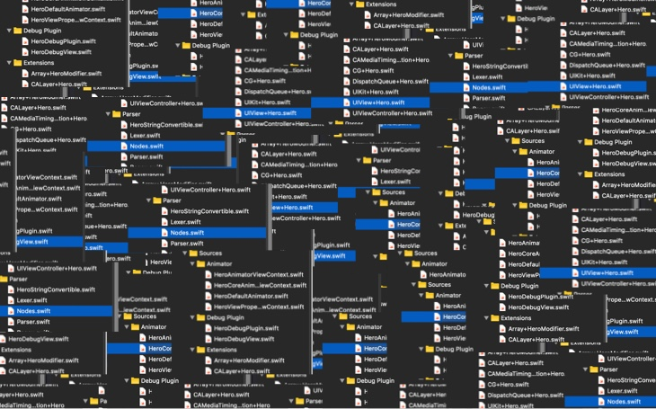

# Code Map 0.7  

把全部项目代码转换成一个思维导图    \(暂时只支持Swift\)

 

 

## 读别人代码是一种什么体验?

 

 

我相信大家都感同身受...

 

 

## How to change it?
 

在不熟悉项目结构的时候,查看一段代码你需要  🤯😱🤔🤮

使用CodeMap查看一段代码你只需要  🧐🤩🥳

 

 

## How to use CodeMap?
 

\(暂时只支持.swift文件\)

1、下载脚本

2、更改CodeMap.py中的目录地址

3、运行脚本

4、使用XMind\([https://www.xmind.cn/](https://www.xmind.cn/)\)导入生成的CodeMap.md文件

 

 

## What else can CodeMap do \(with XMind\)?
 

1、标注代码之间的关系

2、备注某段代码

3、把某个子树扩展到整个画布上

 

 

## How does CodeMap do it?
 

change code to .md to mind map

把代码转换为md文件再导入思维导图

### 欢迎改进CodeMap并且提交给我\!

